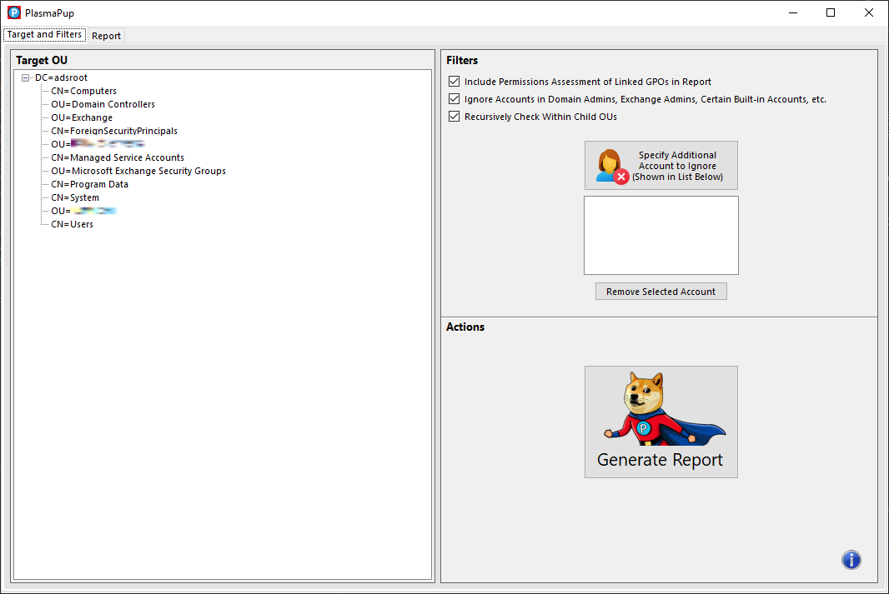

    

&nbsp;

PlasmaPup
=========

## Effortlessly Audit Active Directory Permissions

PlasmaPup is designed to help central and departmental IT personnel understand 
their exposures in Active Directory by showing which accounts have permissions 
to make changes within their OU(s) or modify group policy applying to thier 
OU(s).

PlasmaPup was written by Ross Geerlings and is licensed under the terms of the 
MIT license, reproduced below.\n\nThe MIT License.

Copyright (c) 2024 The University of Michigan Board of Regents.

Permission is hereby granted, free of charge, to any person obtaining a copy 
of this software and associated documentation fime-les (the "Software"), to 
deal in the Software without restriction, including without limitation the 
rights to use, copy, modify, merge, publish, distribute, sublicense, and/or 
sell copies of the Software, and to permit persons to whom the Software is 
furnished to do so, subject to the following conditions:

The above copyright notice and this permission notice shall be included in 
all copies or substantial portions of the Software.

THE SOFTWARE IS PROVIDED "AS IS", WITHOUT WARRANTY OF ANY KIND, EXPRESS OR 
IMPLIED, INCLUDING BUT NOT LIMITED TO THE WARRANTIES OF MERCHANTABILITY, 
FITNESS FOR A PARTICULAR PURPOSE AND NONINFRINGEMENT. IN NO EVENT SHALL THE 
AUTHORS OR COPYRIGHT HOLDERS BE LIABLE FOR ANY CLAIM, DAMAGES OR OTHER 
LIABILITY, WHETHER IN AN ACTION OF CONTRACT, TORT OR OTHERWISE, ARISING FROM, 
OUT OF OR IN CONNECTION WITH THE SOFTWARE OR THE USE OR OTHER DEALINGS IN THE 
SOFTWARE.

The icon used on the additional account button in the PlasmaPup application is 
made by Icons8. Their icons can be viewed at https://www.icons8.com.
